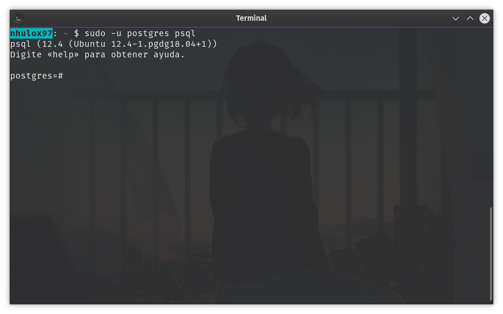
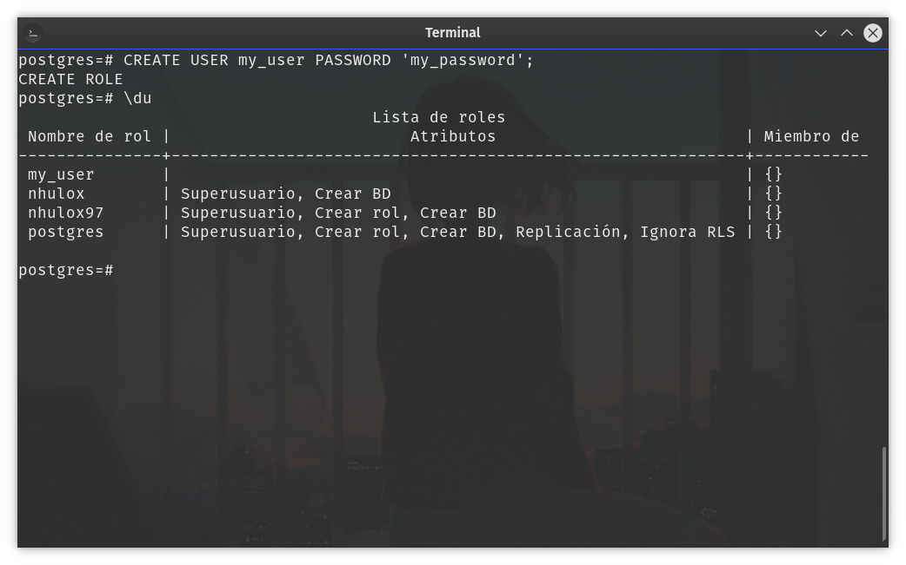
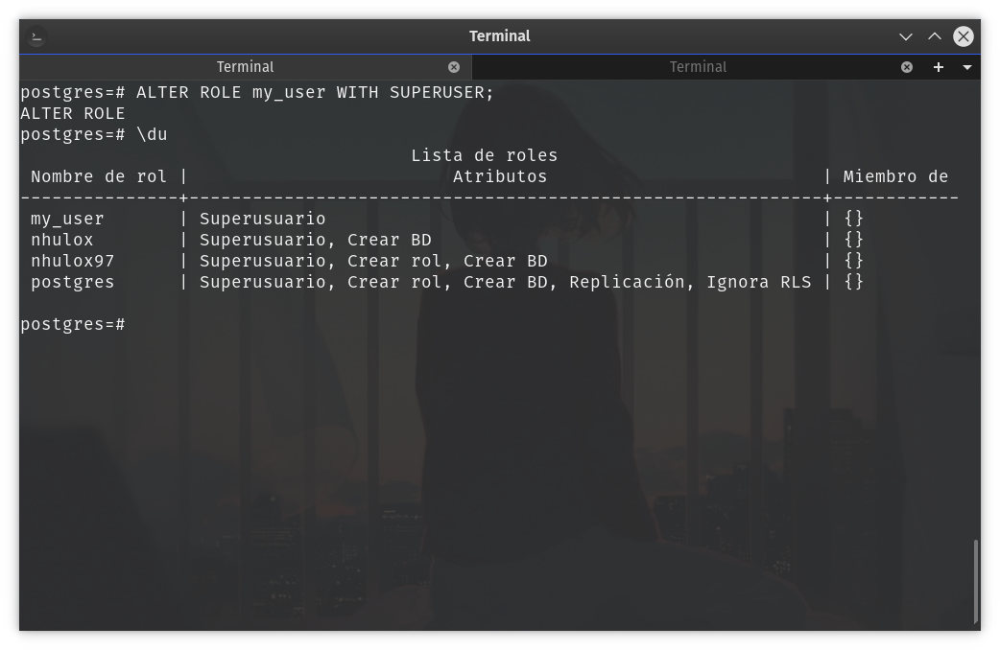
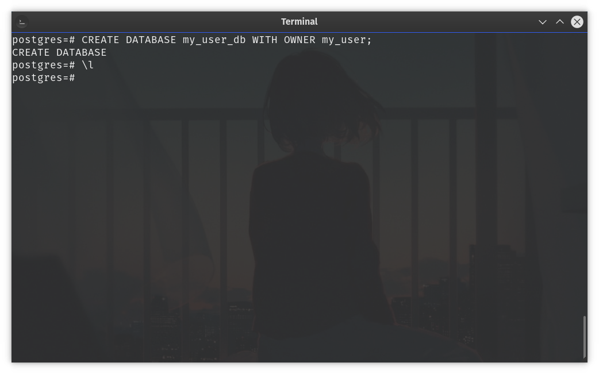
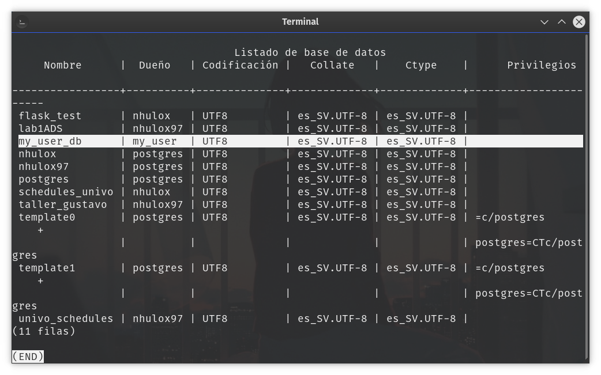

# Creando mi usuario en Postgresql (by [nhulox97](https://github.com/nhulox97))


---
PostgreSQL, también llamado Postgres, es un sistema de gestión de bases de datos relacional orientado a objetos y de código abierto, publicado bajo la licencia PostgreSQL, similar a la BSD o la MIT.

PostgreSQL es una de las mejores opciones en el mercado de Sistemas Gestores de Bases de Datos (SGBD), si lo que estás buscando es una opción de libre uso entonces Postgres es una buena elección.

En esta ocasión estaremos aprendiendo a *cómo crear un usuario* en el antes mencionado SGBD, es necesario que sepamos hacer esto para poder administrar correctamente nuestras bases de datos así como el acceso a ello.

> En este tutorial se da por hecho que usted ya ha instalado Postgres en su equipo, y por ende que el servicio se está ejecutando correctamente.

## Accediendo a Postgres

Lo primero que debemos hacer es acceder al CLI de Postgres, desde Windows, buscamos el programa desde la barra de aplicaciones y ejecutamos como administrador, desde Linux (Debian based), abrimos nuestra terminal y ejecutamos el siguiente comando:

```
sudo -u postgres psql 
```

nos debe aparecer algo similar a la siguiente imagen:



## Creando nuestro usuario

Para poder crear nuestro usuario, se debe ejecutar desde el CLI de Postgres, el siguiente comando:

```sql
CREATE USER my_user PASSWORD 'my_password';
```

en donde **my_user** es el nombre del usuario que tu elijas y **my_password** es la contraseña que elijas. Para saber si nuestro usuario fue creado lo podemos hacer mediante la isntrucció `\du` la cual sirve para listar todos los usarios existentes en Postgres. Todo lo anterior debería lucir así:



## Otorgandole permisos a nuestro usuario

Como pudiste notar **my_user**, a diferencia de los otros usuarios no posee ningún atributo y esto es porque esos se deben asignar mediante `ALTER ROLE`, que nos permite administrar el tipo de acceso que tendrá nuestro usuario. En este caso como estamos creando nuestro usuario es necesario brindarle permisos elevedos (`SUPERUSER`).

Los permisos son un tema delicado y con el cual debes tener cuidado, recomiendo leer un poco mas sobre ello [aquí](https://www.postgresql.org/docs/9.0/user-manag.html) en la documentación oficial de Postgres 9.0.

Entonces, prosiguiendo con el proceso de asignarle permisos a nuestro usuario hacemos lo siguiente:

```sql
ALTER ROLE my_user WITH SUPERUSER;
```

Para poder apreciar los resultados volvemos a listar los usuarios y se vería así:



## Creando una BD para nuestro usuario
Como ultimo paso vamos a crear una nueva base de datos cuyo propietario será el usuario que recién creamos, a continuación el proceso: 



Ahora para confirmar que nuestra base de datos pertenece al usuario que hemos creado ejecutamos el comando `\l` para listar todas las bases de datos del sistema. En la imagen aprecie el resultado que aparece sombreado:



Como podemos apreciar en la imagen, en efecto, la nueva base de datos pertenece al usuario **my_user**.

Y con eso hemos finalizado el proceso de creación de nuestro usuario para Postgres, ahora podremos iniciar sesión desde cualquier SGBD o conectarnos desde cualquier API con nuestro lenguaje de programación; gracias por haber terminado el tutorial, danos follow y deja tu 🌟 en el repo.

> Cualquier duda no dudes en comunicarte conmigo (nhulox97) puedes encontrar todas mis redes en mi perfil de GitHub.

---

## About me


- 🐈 GitHub: [nhulox97](https://github.com/nhulox97).
- 📷 Instagram: [nhulox97_dev](https://www.instagram.com/nhulox97_dev/).
