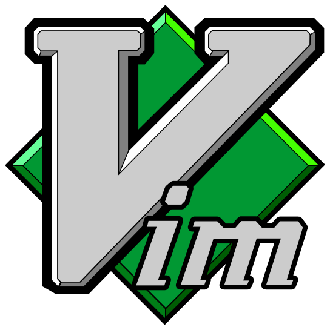

# Configurando vim
Lo primero que vamos a necesitar para poder configurar nuestro editor de texto **vim**, es un administrador de plugins. Los plugins son herramientas creadas por otros programadores, para expandir las capacidades de nuestro ya potente **vim**.


---

### Tip
> Esta configuración es para sistemas operativos basados en UNIX, para Windows revisar el repositorio ofical de vundle (https://github.com/VundleVim/Vundle.vim) ahí encontrás instrucciones de cómo configurar en Windows.

## Instalando vundle
Hay muchos administradores de plugins, personalmente prefiero usar vundle. A continuación te dejo las instrucciones de cómo iinstalar y configurar vundle (es necesario que tengas instalado git).

```
git clone https://github.com/VundleVim/Vundle.vim.git ~/.vim/bundle/Vundle.vim
```
con el anterior comando lo que estamos haciendo es clonar el plugin vundle en la ruta donde se debe hcaer para que este funcione correctamente.

## Creando nuestro archivo .vimrc
Despues de haber clonado vundle es necesario que creemos nuestro archivo `.vimrc`, en dicho archivo es donde estarán expresadas todas nuestras configuraciones, a continuación los pasos necesarios:

```
curl -fLo ~/.vimrc "https://raw.githubusercontent.com/nhulox97/tutoriales_wazunga/master/vim/configure_vim/my_config3.vimrc"
```
luego ejecutamos el siguiente comando

```
vim +PluginInstall +qall
```

si realizaste todos los pasos correctamente al abrir nuevamente `vim` debería lucir así:


Y con esto podríamos dar por terminado este tutorial, puedes unirte a nuestro [servidor de discord](https://discord.gg/fNrRPX) para estar al tanto de nuevos tutoriales y cosas cool.

---

## About me


- 🐈 GitHub: [nhulox97](https://github.com/nhulox97).
- 📷 Instagram: [nhulox97_dev](https://www.instagram.com/nhulox97_dev/).

