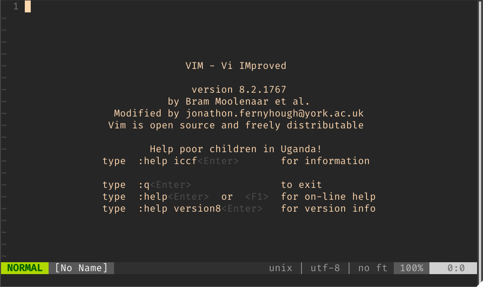

# # Instalar VIM 8.2+ en Ubuntu o Debian


---

## Añadiendo el repositorio.

Dependiendo de la versión del sistema operativo en cuestión que tu tengas instalado, la versión de vim que está alojada en los respositorios de tu sistema puede variar, por tanto es necesario añadir una fuente de la que podamos descargar **Vim** en su versión 8.2. A continuación debes abrir tu terminal y ejecutar los siguientes comandos:

Agregamos el repositorio:

```bash
sudo add-apt-repository ppa:jonathonf/vim
```

## Actualizando la caché
Actualizamos la caché de los paquetes disponibles en nuestros repositorios:

```bash
sudo apt update
```
## Instalando vim
Y por último instalamos vim:

```bash
sudo apt install vim
```
## Comprobando la instalación
Para verificar que **Vim** se instaló correctamente, debemos ejeuctar el comando `vim` y nuestra terminal deberá mostrar algo como lo siguiente:



---

## Desinstalar vim
Si por alguna razón quieres desisntalar **Vim** lo que debes hacer es ejecutar los siguientes comandos, y estarías desinstalando **Vim** y el repositorio que agregaste.

```bash
sudo apt purge vim
sudo add-apt-repository --remove ppa:jonathonf/vim
```
